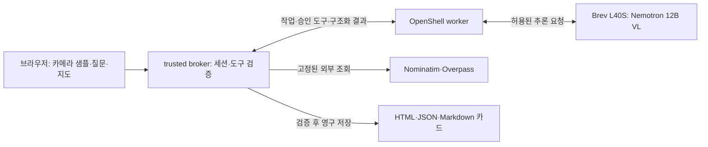

# 한글동행 주요 로직 — 5분 발표와 1분 기술 질의응답

기준: 2026-10-07 worker19 관련 소스와 이번 사용자 확인 보고. 문서 담당은 코드·런타임·테스트를 변경하거나 모델·외부 검색을 재실행하지 않았다.

**현재 확인:** 랜드마크 인식 → 설명 → 주변 OSM 음식점 지도 표시의 흐름을 사용자가 확인했다(**USER_VERIFIED**). 자동화된 독립 감사나 모든 장소·기기의 통과 판정으로 확대하지 않는다. 기존 worker12 기록과 최근 worker19 사용자 확인은 다른 버전·검증 방식이다.

**공통 평가 경로:** 별도 OpenShell 평가 sandbox에서 공식 공개 입력 20개를 읽고 NVIDIA 모델로 질문 1건을 처리해 `/hackathon/output`의 JSON·Markdown을 회수했다. 전체 3.135초, 모델 호출 1회 2.334초. ‘해담문화원의 장소는?’에 자료 부족으로 답해 주소를 지어내지 않은 범위만 확인했다. 일반 질문 전체 정확도는 미검증이며 답변의 자료 부족 문장은 영어다. [실제 답변·정책·실행 근거](../runtime/CHALLENGE-COMPATIBILITY.md)를 함께 제시한다. 공식 fork는 별도로 존재하고 제품 저장소는 독립 저장소다.

## 핵심 문장

“한글동행은 눈앞의 한국 문화 장소를 관찰하고, 사용자가 관심을 보이면 같은 장소의 공식 자료를 설명한 뒤 주변 식사와 저장 가능한 여행 카드로 연결합니다.”

모델은 시각 관찰과 근거를 사용한 설명에 참여한다. 식당 검색의 분기·외부 요청·거리순 정렬·권한 검사는 코드가 담당한다. 모든 단계를 모델이 자유롭게 계획하거나 실행한다고 설명하지 않는다.

## 작은 구조도

OpenShell 경계는 worker의 파일·네트워크 접근에 적용된다. browser의 카메라·음성·지도와 broker의 OSM 조회는 이 경계 밖이며 각각 별도의 동의·입력 검증·접근 제한이 필요하다.

## 5분 발표 원고 — 시연 90초 포함

### 0:00–0:30 · 사용자가 얻는 것

“한국 여행에서는 건물 이름을 아는 것에서 끝나지 않고, 어떤 문화적 의미가 있는지 이해하고 다음 행동으로 이어가는 것이 중요합니다. 한글동행은 카메라로 주변을 살펴보고, 관심 있는 장소의 이야기를 공식 출처와 함께 설명합니다. 이어서 주변 음식점을 지도에서 확인하고 안내를 카드로 저장할 수 있습니다.”

### 0:30–1:10 · 카메라는 어떻게 보내는가

“카메라 미리보기는 기기 안에서 계속 보입니다. 분석에는 정지 사진을 보냅니다. 자동동행을 켜면 첫 관찰은 3초 뒤 시작하고, 이후에는 앞선 작업이 끝난 뒤 최소 20초를 기다립니다. 동시에 하나만 처리하고 수동 질문을 우선합니다. 사용자가 멈추거나 확인 질문을 받으면 자동 관찰을 중지합니다. 연속 영상을 전송하거나 과거 영상 전체를 기억하는 구조는 아닙니다.”

근거: [카메라 수명·캡처](../../web/src/useCamera.ts), [첫 3초·이후 20초 스케줄](../../web/src/autoCompanion.ts), [자동동행 연결](../../web/src/useAutoCompanion.ts), [사진 고정·수동 질문·중지 처리](../../web/src/App.tsx).

### 1:10–2:00 · NVIDIA 모델과 자발적 질문

“Brev의 L40S에서 vLLM으로 NVIDIA Nemotron Nano 12B v2 VL BF16을 서빙합니다. 첫 관찰에는 정답 장소 목록이나 이전 대화를 주지 않고 현재 프레임을 봅니다. 모델은 보이는 특징, 읽을 수 있는 글자, 문화 랜드마크 여부와 자유 형식 장소 이름을 구조화해 반환합니다. 일반 사물이나 문화적 의미가 불명확한 장면은 조용히 지나갑니다. 문화 장소라면 관심을 묻되, 이름이 불확실할 때 특정 장소로 확정하지 않습니다.”

문화 랜드마크 여부 판단과 장소 식별의 확실성은 별도 필드다. 식별 근거가 부족하면 확정 장소명을 연결하지 않으며, 실제 관찰 결과에 없는 설명을 성공 사례로 제시하지 않는다. 질문 없는 자동 결과는 UI의 이전 답변을 덮거나 TTS를 새로 재생하지 않는다.

근거: [시각 관찰 스키마·프롬프트](../../agent/visual_observation.py), [모델·관찰 흐름](../../agent/core.py), [실제 서빙 구성](../runtime/README.md), [서빙 스크립트](../../infra/serve_nemotron.sh).

### 2:00–2:45 · “응, 알려줘”가 같은 장소를 이어가는 이유

“관찰한 장소 이름과 직전 제안은 세션의 last_visual_observation에 남습니다. 사용자가 ‘응, 알려줘’라고 하면 앞서 제안한 장소의 설명을 이어갑니다. 카메라를 멈췄다고 다른 장소로 바꾸지 않고, 새 프레임이 생겼다는 이유만으로 그 프레임까지 같은 장소라고 확정하지 않습니다. 롯데월드타워와 남산서울타워에는 한국관광공사의 승인 자료를 연결했습니다. 해당 장소의 자료가 부족하면 그 부족함을 알립니다.”

후속 설명은 이름·별칭과 일치하는 문화 근거를 골라 모델에 제공한다. 인용 ID·설명 범위·연도를 검사하며, 한국어 주장에는 선택된 승인 자료의 문장을 사용한다. 이것이 모든 문장의 사실성을 완전히 증명한다는 뜻은 아니다. 사용자의 짧은 긍정은 설명 허용이며 장소가 실제로 확인됐다는 판정이 아니다.

근거: [관찰 문맥 전달·저장](../../service/main.py), [후속 이름 유지·근거 선택](../../agent/core.py)의 `_visual_followup_name`, `_answer_observed_place`, [공식 자료 레코드](../../data/evidence.json).

### 2:45–4:15 · 실제 흐름 시연 90초

1. 카메라 또는 실제 샘플 사진을 보여주고 입력 종류를 밝힌다. 샘플 사진이면 현장 촬영으로 소개하지 않는다.
2. 관찰 결과가 나오면 제안한 장소와 불확실성을 확인한다. 관심 질문에 “응, 알려줘”라고 답해 같은 장소의 설명·출처를 보여준다.
3. “주변 음식점 추천해줘” 또는 화면의 주변 음식점 버튼을 사용한다. 같은 랜드마크 기준점에서 지도와 음식점 결과가 나오는지 보여준다.
4. “이 목록은 공개지도에서 찾은 거리순 최대 3곳입니다. 맛이나 평점 순위, 현재 영업 여부는 확인하지 않았습니다”라고 설명한다.
5. 결과 카드의 출처와 다운로드를 보여준다. 이번 실물 시연에서 다운로드하지 못했다면 완료했다고 말하지 않는다.

시연 중 설명: “랜드마크 이름은 Nominatim으로 위치를 조회하고, 주변 음식점은 Overpass에서 찾습니다. 고정된 요청 형식과 거리 계산은 broker 코드가 수행합니다. 모델이 임의의 웹사이트를 골라 식당을 평가하는 구조는 아닙니다.”

응답이 늦거나 외부 조회가 실패하면 화면의 실제 상태를 설명한다. 사전 녹화를 사용할 때는 해당 버전·샘플 사진·대기 압축 여부를 밝힌다. 90초는 발표 시간 배분이며 제품 응답 시간 보장이 아니다.

### 4:15–5:00 · 권한 경계와 실제 산출물

“OpenShell worker는 읽기 전용 코드·자료와 필요한 임시 공간만 사용하고, 지정 broker와 모델 endpoint만 호출합니다. broker는 세션과 요청 소유권, 승인 근거, 해당 요청에서 조회한 장소와 좌표를 대조한 뒤 영구 카드를 저장합니다. 모델은 파일 경로를 정하지 않습니다. 현재 랜드마크 인식부터 설명과 주변 지도까지는 사용자 확인을 받았으며, 자동화된 전체 품질 감사와는 구분합니다.”

마지막 화면: 여행 카드 또는 실제 지도·출처. 기존 통제 시험의 차단 근거는 질의 시 [보안 실측 문서](../runtime/SECURITY-EVIDENCE.md)로 제시한다. 기존 시험을 worker19의 모든 기능 검증으로 확대하지 않는다.

## 기술 설명용 정확한 구분

| 처리 | 실제 담당과 코드 |
|---|---|
| 사진 관찰·문화 여부·자유 형식 이름 | Nemotron VL + [VisualObservation](../../agent/visual_observation.py). 사전 카탈로그 이름을 정답 선택지로 넣지 않는다. |
| 문화 설명 | [agent/core.py](../../agent/core.py)의 승인 근거 선택, 모델 구조화 응답, 범위·인용·연도 검사. 근거가 없으면 부족함을 표시한다. |
| 짧은 후속 대화 | [service/main.py](../../service/main.py)의 세션 `last_visual_observation`과 [core.py](../../agent/core.py)의 제한된 후속 요청 판별. 전체 영상 기억이 아니다. |
| 주변 식당 요청 판별 | [core.py](../../agent/core.py)의 `_nearby_restaurants`가 한국어·영어 요청과 직전 관찰 문맥을 규칙으로 판별한다. 이 분기 자체에 새 모델 판단이 필수인 것은 아니다. |
| 좌표·식당 조회·정렬 | [service/nearby.py](../../service/nearby.py)의 고정 Nominatim·Overpass 요청. 반경 안 결과를 직선거리, 동일 거리에서는 ID 순으로 정렬해 최대 3개를 반환한다. |
| 지도 | [MapView.tsx](../../web/src/MapView.tsx)와 [App.tsx](../../web/src/App.tsx). 랜드마크 조회 좌표는 사용자의 GPS가 아니다. 외부 식당은 OSM 원문으로 연결하며 기존 카탈로그 ID로 바꾸지 않는다. |
| 검증·저장 | [service/main.py](../../service/main.py)의 `validate_grounding`, `save_result`; [service/render.py](../../service/render.py)의 카드 렌더. worker는 내용만 반환한다. |

## OSM 외부 통신과 최소 권한

- **위치:** Nominatim·Overpass는 trusted broker가 호출한다. worker가 이 외부 도메인에 직접 접속하는 구조가 아니며 OpenShell worker의 허용목록 확대와 구분한다.
- **전송:** Nominatim에는 랜드마크 이름, Overpass에는 기준 좌표·반경·음식점 조건이 간다. 사진·음성 원본·모델 프롬프트·worker 인증정보는 OSM 조회에 보내지 않는다. 사용자 좌표는 사용자가 허용·선택한 경우에 사용하며 외부 지도 조회에 전달될 수 있다.
- **제한:** 고정 HTTPS endpoint, 리다이렉트 금지, 입력·좌표 검증, 1MB 응답 상한, 단일 조회, 캐시, Nominatim 요청 간격 1초 이상, 전체 호출 약 15초 제한이 코드에 있다. 이 제한은 단일 broker 프로세스 기준이다.
- **실패:** 위치 미지정, 조회 실패, 결과 없음은 상태로 반환한다. 가짜 식당이나 확인하지 않은 평점·영업 상태로 채우지 않는다.
- **worker 파일 권한:** `/app` 등은 읽기 전용, `/tmp`·`/dev/null`은 쓰기 가능하다. 쓰기 가능한 공간의 삭제까지 금지했다고 설명하지 않는다. REST 규칙은 `enforce`이며 provider가 합성한 실효 정책을 확인해야 한다.
- **저장:** broker가 검증 후 `.runtime/output/<request_id>/travel-card.json`, `.html`, `.md`를 생성한다. 출력 위치는 설정으로 바뀔 수 있고 다운로드도 세션 소유권을 검사한다.

근거: [주변 조회 구현](../../service/nearby.py), [broker 검색 경계](../../service/main.py), [정책 생성기](../../infra/render_policy.py), [권한 설명](../../policy/README.md), [API 계약](../../shared/api-contract.md).

## 공식 자료를 설명하는 방법

[승인 자료](../../data/evidence.json)의 `visitkorea:lotte-world-tower-culture`와 `visitkorea:n-seoul-tower-culture`는 한국관광공사 자료 URL·대상 이름 별칭·문화 설명 범위를 가진다. 롯데월드타워의 디자인·규모와 남산서울타워의 방송·전망대 역할 설명에 연결한다.

- [한국관광공사 롯데월드타워](https://english.visitkorea.or.kr/svc/contents/contentsView.do?vcontsId=72115)
- [한국관광공사 남산서울타워](https://english.visitkorea.or.kr/svc/contents/contentsView.do?vcontsId=88026)

자료가 있다는 사실은 사진 인식 정확도, 현재 운영 상태, 모든 자유 형식 장소의 설명 가능성을 증명하지 않는다. 이 문서에서는 새 외부 원문 조사나 실시간 운영 확인을 수행하지 않았다.

## 1분 기술 질의응답 — 각 15초

| 질문 | 짧은 답변 |
|---|---|
| “어느 부분이 AI의 판단인가요?” | “현재 사진의 문화적 의미와 장소 이름을 모델이 관찰하고, 맞는 근거로 설명을 만듭니다. 후속 요청 분기·식당 조회·거리 정렬·저장은 코드가 통제합니다.” |
| “영상을 계속 분석하고 기억하나요?” | “로컬 미리보기와 정지 프레임 분석을 분리했습니다. 첫 3초, 이후 앞선 작업 완료 후 20초 간격이며, 직전 관찰 이름·질문을 이어갈 뿐 전체 영상 기억은 없습니다.” |
| “OpenShell이 OSM 통신까지 차단하나요?” | “OpenShell은 worker의 파일·통신 경계입니다. OSM은 broker의 별도 고정 도구이며 사진·인증정보를 보내지 않고 입력·응답 크기·시간을 제한합니다.” |
| “실제로 어디까지 검증됐나요?” | “worker19 인식→설명→주변 지도는 사용자 확인입니다. 자동화된 전체 감사는 아니며, 공통 챌린지 입력 어댑터 연결은 별도 보완 중입니다.” |

## 발표 전 상태 확인

- `USER_VERIFIED`: 이번 사용자가 확인한 worker19의 랜드마크 인식 → 설명 → 주변 OSM 음식점 지도.
- 별도 근거: 과거 모델 실행·OpenShell 통제 시험은 해당 버전과 시험 범위로만 설명한다.
- `PENDING`: 공통 입력 어댑터 연결·공식 챌린지 적격 검수, 새 버전의 자동화된 전체 검증.
- 이번 문서 작성은 기존 PPT/PDF 수정·모델 호출·외부 검색·코드 변경·테스트 실행·대외 제출을 포함하지 않는다.
